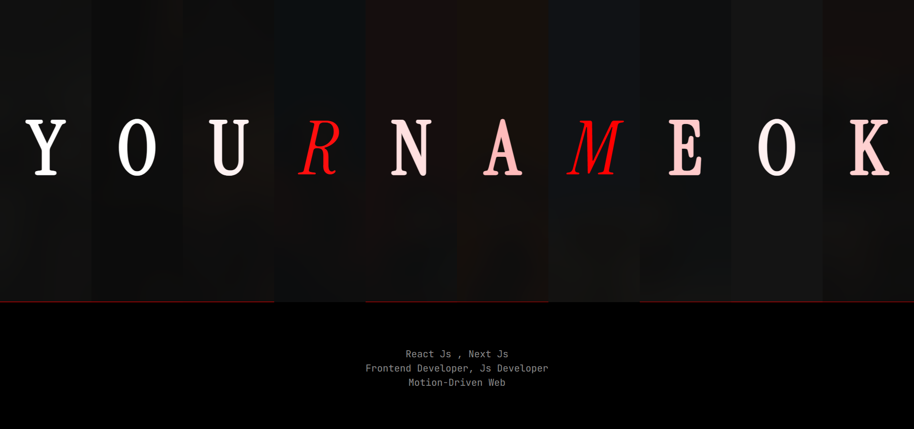

# <a href="https://bilalmlk-portfolio.vercel.app" target="_blank"> Frontend Developer Portfolio</a>

**This Portfolio** is a modern, motion-driven frontend showcase built with **React** & **CSS3**.
It highlights high-performance UI, smooth animations, immersive interactions, and creative frontend engineering.

Built for speed, aesthetics, and clean architecture — fully responsive and optimized for production.

<p align="left">
<a href="./LICENSE"> </a>


<a href="https://github.com/byllzz"></a>

</p>
<br>

[](https://bilalmlk-portfolio.vercel.app)
<br>



⭐ **Star the repo if you like it — it really helps!**
<br>

---

# ✨ Features

✔️ Modern Hero Section with Motion Animations<br>
✔️ Fully Responsive (Mobile, Tablet & Desktop)<br>
✔️ Smooth Framer Motion Transitions<br>
✔️ Interactive Project Showcase<br>
✔️ Animated Buttons & UI Micro-Interactions<br>
✔️ Performance Optimized (Lighthouse Friendly)<br>
✔️ Clean Component Architecture<br>
✔️ SEO Optimized Meta Tags<br>
✔️ Fast Loading (Optimized Assets)<br>
✔️ Deployed on Vercel

---

## 🛠 Tech Stack

- **React.js**
- **Next.js** (if applicable)
- **Tailwind CSS**
- **Framer Motion**
- **JavaScript (ES6+)**
- **Vite** (if used)
- **Vercel Deployment**

<br>

## ⚙️ How It Works

This portfolio is designed with **modular, reusable components** for flexibility and maintainability:

1. **Component-Based Architecture**
   - Each section (Hero, About, Projects, Skills, Experience, Contact, Footer) is a standalone React component.
   - Data is centralized in a `data.js` / `config.js` file, making content easy to update.

2. **Motion & Animations**
   - Framer Motion powers smooth entrance animations, hover effects, and staggered transitions.
   - GPU-accelerated transforms ensure high performance and fluid interactions.

3. **Styling & Layout**
   - Tailwind CSS handles utility-first styling for responsive and clean layouts.
   - Custom CSS modules maintain scoped styles for each component.

4. **Project & Skills Data**
   - Project cards, skill lists, and experience sections pull dynamically from centralized data objects.
   - Easy to add, remove, or update projects and skills without touching component logic.

5. **Responsive & Optimized**
   - Fully mobile-first design with breakpoints for tablet and desktop.
   - Lazy loading images and optimized assets ensure fast page loads.

6. **SEO & Meta Integration**
   - Open Graph, Twitter Cards, and meta tags are pre-configured for sharing and search engine visibility.

7. **Deployment Ready**
   - Configured for **Vercel** deployment with zero build issues.
   - Optimized for production performance and Lighthouse metrics.

---

## 🚀 Installation & Setup

### 1️⃣ Requirements

Before you begin, ensure you have:

- **Node.js** (v18+ recommended)
- **npm** or **yarn**

---

### 2️⃣ Clone the Repository

```bash
git clone https://github.com/byllzz/portfolio.git
cd portfolio
npm install   # or yarn install
npm run dev   # or yarn dev

## 📄 License

This project is licensed under the **MIT License**.
See the [LICENSE](./LICENSE) file for more details.

---

```

##  Contact & Feedback

If you’d like to collaborate, report an issue, or share feedback, feel free to reach out:

-  **Email:** bilalmlkdev@gmail.com
-  **Portfolio:** https://bilalmlk-portfolio.vercel.app
-  **GitHub:** https://github.com/byllzz

If you like the design or animations, please ⭐ **star the repository** — it really helps and motivates future updates!
