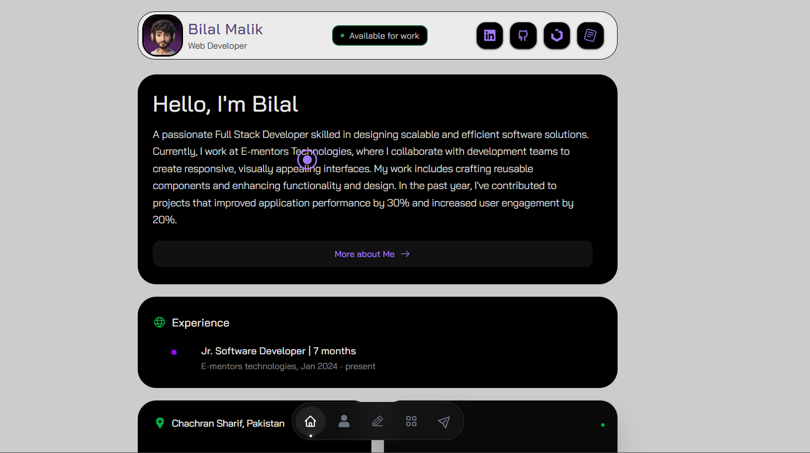

# <a href="https://moviio.vercel.app" target="_blank">Bilal Malik — Frontend Developer Portfolio</a>

**Bilal Malik Portfolio** is a modern, motion-driven frontend showcase built with **React** & **Tailwind CSS**.
It highlights high-performance UI, smooth animations, immersive interactions, and creative frontend engineering.

Built for speed, aesthetics, and clean architecture — fully responsive and optimized for production.

<p align="left">
<a href="./LICENSE"> 
</a>

 
 <a href="https://github.com/byllzz">
  </a>
  </p> <br />


[](https://portfolio.vercel.app) <br>

 
⭐ **Star the repo if you like it — it really helps!**
 <br>

---

 # ✨ Features

✔️ Modern Hero Section with Motion Animations <br>
✔️ Fully Responsive (Mobile, Tablet & Desktop)<br>
✔️ Smooth Framer Motion Transitions<br>
✔️ Interactive Project Showcase<br>
✔️ Animated Buttons & UI Micro-Interactions<br>
✔️ Performance Optimized (Lighthouse Friendly)<br>
✔️ Clean Component Architecture<br>
✔️ SEO Optimized Meta Tags<br>
✔️ Fast Loading (Optimized Assets)<br>
✔️ Deployed on Vercel

---


## 🛠 Tech Stack

- **React.js**
- **Next.js** (if applicable)
- **Tailwind CSS**
- **Framer Motion**
- **JavaScript (ES6+)**
- **Vite** (if used)
- **Vercel Deployment**

<br>

##  How It Works

- Built using a **component-based architecture**
- UI animations powered by **Framer Motion**
- Styled using **utility-first Tailwind CSS**
- Optimized rendering with minimal DOM usage
- Smooth transitions using **GPU-accelerated transforms**
- Fully client-side interactive experience
- Production-ready deployment on **Vercel**


##  Installation & Setup

### 1️⃣ Requirements

Before you begin, make sure you have:

- **Node.js** (v18+ recommended)
- **npm** or **yarn**

---

### 2️⃣ Clone the Repository

```bash
git clone https://github.com/byllzz/portfolio.git
cd portfolio

```
<br>

## 📄 License

This project is licensed under the **MIT License**.
See the [LICENSE](./LICENSE) file for more details.

---

## 📬 Contact & Feedback

If you’d like to collaborate, report an issue, or share feedback, feel free to reach out:

-  **Email:** bilalmlkdev@gmail.com
-  **Portfolio:** https://your-portfolio-url.com
-  **GitHub:** https://github.com/byllzz

If you like the design or animations, please ⭐ **star the repository** — it really helps and motivates future updates!
